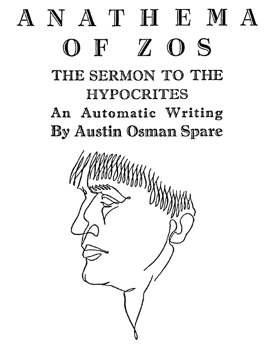

# オースティン・オスマン・スペアの『ゾスの呪詛――偽善者たちへの説教』翻訳Zine

このZineは、オースティン・オスマン・スペアの自動書紀による文『ゾスの呪詛――偽善者たちへの説教』の全文を、翻訳したものです。

**by 知られざる呪術師（*Le Sorcier Inconnu*）**  

ディスコーディアン暦3191年 POPの祝日 第23金曜日  
――欲望のアルファベット🔥を讃える日  

---

 

---

### 🇯🇵 日本語

👉 [クリックして読む](Anathema_of_Zos_J.md)

---

### 🇬🇧 原文

👉 [クリックして読む](Anathema_of_Zos_E.md)

---

### 🖋️ 訳者コメント：ZOS、ニーチェ、そして語りの力

『ゾスの呪詛――偽善者たちへの説教』を訳していて、私は自然とニーチェの『ツァラトゥストラかく語りき』を思い出した。
この文書には、自らの語りを武器に世界と対峙する者の声がある。
そして、それは単なる反抗でも教義でもなく、語ることそのものが恍惚であり、呪詛であり、詩であるような、稀有な文体の強度に貫かれている。

スペアが若い頃に書いた『快楽の書』では、コウモリの例えによって語られていた「生物は自ら望むことで進化する」という主張が、本書では再び「魚に足が生え、爬虫類に翼が生える」という表現で現れる。
それは、コリン・ウィルソンの言う「欲望が生物の進化を促す」という思想とも呼応しており、ここでも再び、「欲望が世界を創造する」という主題が、凶暴なまでの詩的比喩のなかで燃え上がる。

このテキストは、論理的な魔術指南ではなく、むしろ魔術という語りが言葉の外側に飛び出した時、何が立ち上がるのか──その問いに対して、スペア自身が恍惚のなかで自らを呪い、書き残したシュルレアリスム的な自動書記＝詩的記録である。

まるで、夢の中で晩年のスペアが自分自身に向かって語った予言の残響のようなこの文は、
読む者に、意味を超えた力と、語ることの魔術的暴力性を思い出させてくれるだろう。

---

🗃 関連資料

👉[『半獣神の書（英文）』](AustinOsmanSpare-ABookOfSatyrs-ocr.pdf)

---

### 🔖 免責・著作権に関する注意

本Zineは研究・学術・非営利目的で公開されており、出典を明記したうえで原文の部分引用・翻訳を行っています。

----

© 2025 知られざる呪術師（Le Sorcier Inconnu）
本ドキュメントは Creative Commons BY-SA 4.0 に基づき公開されています。

